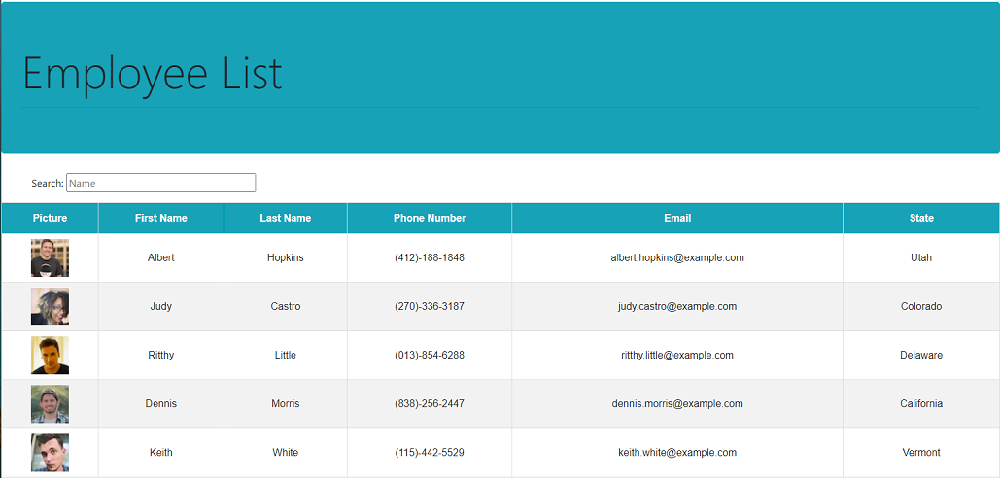

 # Employee Directory
  ---
* [GitHub Repository](https://github.com/MVPeter/EmployeeDirectory)

* [Deployed Code](https://mvpeter.github.io/EmployeeDirectory/)

  
      
  ## Table of Contents
    - Discription
    - Installation
    - Usage
    - Contributions
    - Liscense
    - Questions

  ---
  
  ## Discription

  This project is an example of using an API to get a list of employees and using React to render a table of the information.  You can search for an employee's name and sort by name. 

  

  ---
  
  ## Installation

  npx create-react-app
  npm install 

  ---
  
  ### Usage

    * npm start

  ---
  
  ### Tests

    * none

  
  ### Contributions

    * none

  ---
  
  ### License

    * This project is covered by the following license(s): MIT
    

  ---
  
  ### Questions
  - GitHub Profile: [GitHub Profile](https://github.com/MVPeter)
  - For further questions please contact me at email:  MVPetersen1@gmail.com

  